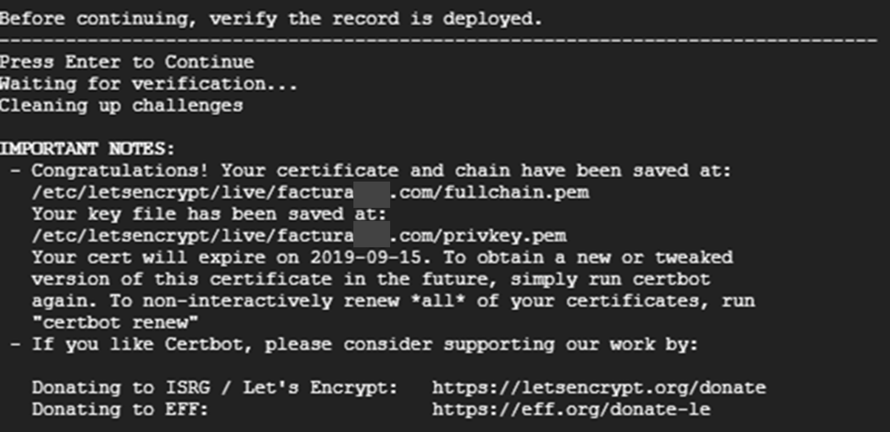

# Pasos

1. **Acceder a su instancia vía SSH.**
    ```bash
    ssh usuario@ip_del_servidor
    ```

2. **Loguearse como super usuario**
    ```bash
    sudo su
    ```

3. **Ubicarse en la carpeta del usuario, por ejemplo**
    ```bash
    cd /home/ubuntu/
    ```

4. **Crear el archivo `install`**
    ```bash
    touch install.sh
    ```

5. **Editar el archivo con su editor preferido**
    ```bash
    nano install.sh
    ```

    - En el archivo, agregar el contenido del siguiente [enlace](https://gitlab.com/snippets/1852652).

    - Para salir del editor y guardar, presionar `Ctrl + x`, confirmar con `y`, y luego `Enter`.

6. **Darle permisos de ejecución al archivo**
    - En el archivo debe agregar el contenido del siguiente enlace: https://gitlab.com/snippets/1852652 Observará a una página como la siguiente, donde debe copiar el contenido del script y pegarlo en su archivo install.sh, es importante que mantenga las estructura del mismo.

    


7. **Para salir de editor y guardar puede presionar “ctrl + x” seguidamente se le consultará  si desea guardar los cambios, confirme con “y” y luego “enter”.**

8. **Debe darle permisos de ejecución al archivo: ejecute chmod +x install.sh**

9. **El comando a utilizar requiere de dos parámetros principalmente:**
    ```bash
    ./install.sh [repositorio] [dominio]
    ```
    por ejemplo:
    ```bash
    ./install.sh https://gitlab.com/rash07/facturadorpro2 elfacturador.com
    ```

10. **Una vez ejecutado el comando se iniciará un proceso donde debe ir aceptando las preguntas y que le mostrará en pantalla los valores que debe añadir en los 2 récords tipo TXT de su dominio con nombre**
    - _acme-challenge.example.com .
    - _acme-challenge (casos como godday y puntope)

**En la siguiente imagen le muestran el valor como v703JW.... debera copiarlo y añadirlo al primer record TXT, seguidamente pulsar enter, se le mostrará en pantalla un segundo valor para el segundo TXT**

    

11. **Editados los récords en su dominio, deberá aceptar para continuar y que el proceso verifique que sea exitoso, de ser exitoso obtendrá una pantalla similar a la siguiente**

    

12. **Continuará el proceso de actualización del sistema, se le solicitará el usuario y contraseña de GitLab, para que se pueda clonar/descargar el proyecto en su instancia, luego culminará y tendrá los accesos listos en su dominio**
    1. Correo: admin@gmail.com
    2. Contraseña: 123456

### Una vez finalizado, puede proseguir con el manual de pruebas o demás documentación de cada proyecto, sus URL son:

**PRO1:**
https://gitlab.com/rash07/facturadorpro1

**PRO2:**
https://gitlab.com/rash07/facturadorpro2

