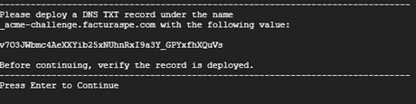
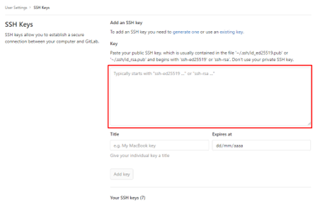

### Pasos

1. **Acceder a la instancia vía SSH:**
    ```bash
    ssh usuario@direccion_ip
    ```

2. **Loguearse como super usuario:**
    ```bash
    sudo su
    ```

3. **Clonar el snippet de GitLab que contiene el script:**
    ```bash
    git clone https://gitlab.com/snippets/2079063.git script
    ```

4. **Ingresar a la carpeta clonada:**
    ```bash
    cd script
    ```

5. **Dar permisos de ejecución al script:**
    ```bash
    chmod +x install.sh
    ```

6. **Ejecutar el script de instalación con el parámetro del dominio:**
    ```bash
    ./install.sh [dominio]
    ```
    Por ejemplo:
    ```bash
    ./install.sh facturador.pro
    ```

7. **Una vez ejecutado el comando iniciará el proceso de actualización del sistema, en el proceso se le solicitará:**
    1. El usuario y contraseña de GitLab, para que se pueda descargar el proyecto en su instancia

    2. Si desea instalar  SSL gratuito, tenga en cuenta que este debe ser actualizado cada 90 días, el mensaje será el siguiente:
        +   Instalar con SSL? (debe tener acceso al panel de su dominio para editar/agregar records TXT). **si[s]** **no[n]**
            1. Deberá contestar con “s” o “n” para continuar

            2. Si selecciona SÍ, deberá contestar las siguientes preguntas con “y”, son 2 en total, seguidamente se le ofrecerá un código que debe añadir en un récord tipo TXT en su dominio quedando como _acme-challenge.example.com o simplemente _acme-challenge dependerá de su proveedor.

            3. Para continuar presione enter, luego deberá repetir las acciones para añadir un segundo código y habrá finalizado la configuración, si el proceso es exitoso la ejecución del script continuará.

            


    3. Si desea obtener y gestionar actualizaciones automáticas, deberá disponer de su sesión de gitlab al momento configurar clave SSH para actualización automática? 
    (requiere acceso a https://gitlab.com/profile/keys)
    **si[***s***]** **no[***n***]**    
        1. deberá contestar con “s” o “n” para continuar

        2. de seleccionar SÍ, al final del despliegue se le dará un extracto de texto que debe añadir a su configuración de gitlab


        


8. **Finalizado el script y dependiendo de sus selecciones anteriores, se le entregará varios datos que debe guardar, como:**

    1. Usuario administrador
    2. Contraseña para usuario administrador
    3. Url del proyecto
    4. Ubicación del proyecto dentro del servidor
    5. Clave ssh para añadir a gitlab (obligatorio para quienes seleccionan la instalación de   SSH)


